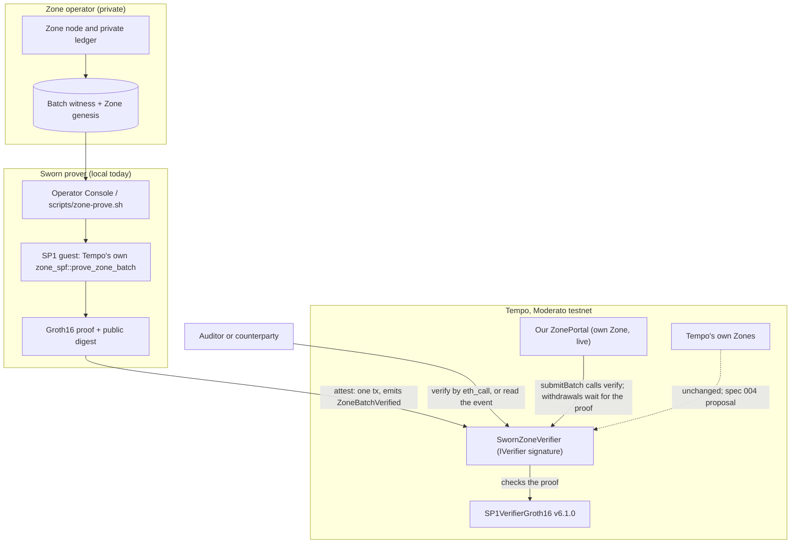
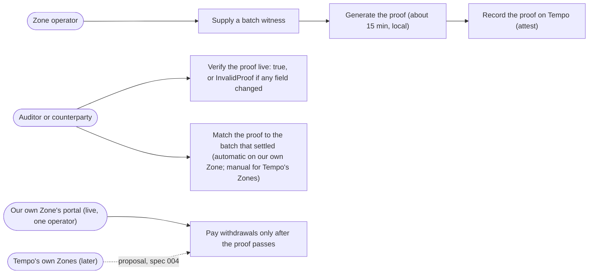
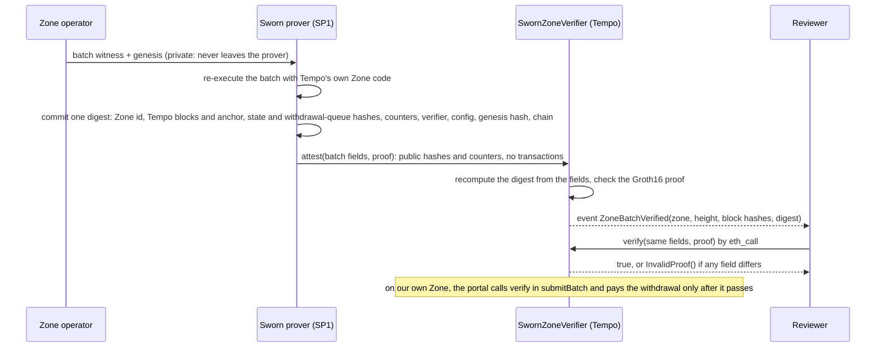

# Sworn

**Private execution. Checkable validity.** Sworn is for Tempo Zones: private ledgers where only the operator sees every
transaction. Sworn runs Tempo's own Zone verifier in SP1, producing a proof plus public batch data that anyone can verify
on chain without publishing transactions.

**Like Zcash? Only in one way.** Zcash uses zero knowledge to prove a shielded transaction is valid without
revealing it. Sworn uses zero knowledge differently: it proves a private Tempo Zone batch executed correctly, without
publishing its transactions. It hides nothing from the Zone's operator, who still sees every transaction: Zones are
private from the public, not from their operator.

Before a private Tempo Zone releases a withdrawal batch, its operator may need to show an auditor or reviewer
evidence without disclosing the private ledger. For an operator-supplied batch, Sworn runs Tempo's own Zone
verification code in SP1 and produces a proof anyone can verify on chain. The public output is hashes and
batch metadata, not customer transaction contents.

**What is built:** on Moderato, our own Zone's portal settles a batch, and queues its withdrawals, only after
Sworn's proof passes: three batches proven and settled, then our sequencer called `processWithdrawals` and the
withdrawal was paid
([payout tx](https://explore.testnet.tempo.xyz/tx/0xfc3118412ed0c4d6a5b0a55e61a567b280861461551f927fc5fc650c541be1f1), 2026-10-06).
The proof is a necessary condition for a payout, not a guarantee of one: it is ZK-gated, not censorship-resistant.
The rejection side is on chain too: our own sequencer, with a valid signature, submitted a forged batch that replayed a
real proof with a made-up withdrawal queue, and the portal rejected it on the proof
([reverted tx](https://explore.testnet.tempo.xyz/tx/0x3a154e4e0b9dde8531a151ff39d6991af76b264d292eab2b8b0b0b31717b167d), 2026-10-07).
**What is not built:** an integration with Tempo-created Zones (it is our own Zone, with one operator), or a
customer workflow. Testnet, unaudited.

Sworn runs Tempo's own code inside an [SP1](https://github.com/succinctlabs/sp1) zero-knowledge VM and
checks the resulting Groth16 proof in a contract on [Tempo](https://tempo.xyz). The CWF submission is the
Zone evidence product:

- **Tempo Zone batches.** Tempo's own Zone batch verifier (`zone_spf::prove_zone_batch`) runs inside
   SP1, and the proof is bound to the exact inputs Tempo's `IVerifier` receives from a ZonePortal.
   `SwornZoneVerifier` is deployed on Moderato. Tempo's docs say ZK proving for Zones *"is not
   implemented"*. Tempo's design (T13) checks batches with a Nitro hardware attestation; on Moderato
   today, which is pre-T13, the reference verifier is a prototype stub that returns `true` without checking
   execution. **On 2026-10-04 a contract on Moderato verified the proof of a test batch with a withdrawal**
   ([tx](https://explore.testnet.tempo.xyz/tx/0xa63009fd13648ed246885b7b476e8284e55bab4d5a9325127155fe292b3df770)),
   after a first batch without one
   ([tx](https://explore.testnet.tempo.xyz/tx/0xb14b7127895ed8431e63154a4d665d0c19492fbb7c09152c13844e35c5023b80)).
   Both batches come from Tempo's integration tests, not from a Moderato Zone.
   **Separately, on 2026-10-06, our own Zone on Moderato settled three proven batches through a portal that calls
   its own instance of `SwornZoneVerifier`, and then our sequencer paid a withdrawal**
   ([payout tx](https://explore.testnet.tempo.xyz/tx/0xfc3118412ed0c4d6a5b0a55e61a567b280861461551f927fc5fc650c541be1f1)). It is our Zone and our
   portal, not a Tempo-created Zone.

(The repository also holds an earlier, separate engine experiment, [bonded answers](#separate-engine-experiment-bonded-answers);
it is not the CWF product.)

> **For judges, the fast path:** the [live page](https://psyto.github.io/sworn/) ·
> [our own Zone's payout](https://explore.testnet.tempo.xyz/tx/0xfc3118412ed0c4d6a5b0a55e61a567b280861461551f927fc5fc650c541be1f1), paid only after three proven batches settled (the page's
> [own-Zone section](https://psyto.github.io/sworn/#own-zone) reads the portal, the receipts and the payout live, and
> "Re-verify on chain" replays the withdrawal batch's verify call: true, and one field changed → `InvalidProof`) ·
> [a forged batch, rejected](https://explore.testnet.tempo.xyz/tx/0x3a154e4e0b9dde8531a151ff39d6991af76b264d292eab2b8b0b0b31717b167d) (sequencer-signed, a real proof replayed; status 0, the verifier reverted) ·
> [the fixture's proof tx](https://explore.testnet.tempo.xyz/tx/0xa63009fd13648ed246885b7b476e8284e55bab4d5a9325127155fe292b3df770)
> (a Zone batch with one withdrawal, from Tempo's integration tests) ·
> "Re-verify on chain" in the page's fixture section (three live `eth_call`s: Sworn, the real proof → true; one field changed →
> `InvalidProof`; for comparison, Moderato's current prototype verifier, the pre-T13 reference stub, returns
> true for an equivalent malformed batch) ·
> pitch (≤ 2:00) and demo (1:22) videos: *links added once the founder narration is uploaded*.
>
> **Status (2026-10-07): built for Colosseum's Crypto World's Fair, Tempo track.** Tempo **Moderato
> testnet** only. Unaudited. No customers or revenue. The Zones created by Tempo's factory on Moderato have one
> effective operator; our own Zone runs outside the factory.

## Sworn in three diagrams

Solid lines are built and running on Moderato testnet today; dashed lines are proposed (spec 004) or not
connected.

### 1. System overview: who runs what



### 2. Use cases



### 3. Data flow: what stays private and what becomes public



What a reviewer learns: that Tempo's own Zone code accepts this exact batch. What a reviewer does not learn:
balances, senders, recipients or amounts inside the Zone.

## Why it matters

Zones are private by design: the operator has full visibility, and each user can see only their own balances
and history. An external reviewer cannot independently recreate the operator's full batch execution from
public data. Sworn creates a checkable proof for a batch the operator supplies, while exposing hashes and
batch metadata rather than transaction contents. Tempo's current Zone design uses a hardware-attestation
path; Sworn is a proposed independent ZK evidence path beside it, not a replacement or current settlement
requirement.

## The plan

**Product hypothesis — Proof Operations.** A Zone business could purchase proof generation for batches it
supplies plus compatibility maintenance when Tempo execution changes. That is a recurring-service thesis, not
a customer claim. For Tempo's own Zones the evidence is off the settlement path: their portals do not call
`SwornZoneVerifier`, and `attest` stores nothing (spec 003 §5 D2, D4), so it protects none of their withdrawals.
Only our own Zone on Moderato settles through it (a one-operator demonstration, 2026-10-06).

**Go-to-market test.** Start with one Zone business that can lawfully supply its witness and has a reviewer
who needs evidence. Prove one supplied batch, give the reviewer reproducible verification instructions, then
ask whether the operator needs the next batch or next upgrade proved. Only a repeat need can become a
per-Zone operations agreement plus per-batch proving. A [local Operator Console](docs/operator-console.md)
starts the existing fixture prover and read-only checks; it is deliberately loopback-only and not a hosted
service.

**Market boundary.** The Zones Tempo's factory created on Moderato have one effective operator (three Zones
with one admin; creation is owner-gated). Our own Zone runs outside the factory and is ours, so it is not a
market signal either: there is no demonstrated operator market or numeric TAM today. The expansion thesis is
conditional: if independent Zone businesses adopt a review workflow, the work repeats for their batches and
for each Tempo execution upgrade. [Spec 004](docs/specs/004-tee-plus-zk.md) describes a later settlement
proposal; it is written, not built, and would require Tempo changes.

**Today:** no customers, revenue, design partner or payer agreement. **Next:** one operator-supplied batch
and a decision by its reviewer about whether the evidence is worth repeating or paying for.

## Who

**Hiroyuki Saito** ([@psyto](https://github.com/psyto)), solo founder, Japan.
- **Rust engineer on Tempo's stack:** Reth, Revm, Alloy and Foundry. Author of
  [Fabrknt Dojo](https://fabrknt.com/dojo) (21 source-grounded courses, 234 lessons, on Rust, Reth, Revm and Alloy) and
  [rdk](https://github.com/psyto/rdk), a DeFi kit on Reth.
- **Previous project:** [Reckn](https://github.com/psyto/reckn) won a Uniswap Foundation sponsor prize
  (Best Uniswap Stack Contribution, 3rd place) at ETHGlobal Tokyo 2026.
- **Colosseum:** 3rd place in the Superteam Japan × NTT DOCOMO R&D side track of Colosseum's Solana Cypherpunk
  Hackathon (2025).
- **Before that:** 15 years building banking systems in Japan, familiar with banking regulation;
  earlier, software development in Hong Kong and India.

Getting Tempo's code into a zkVM meant patching it (`patches/`, `spikes/zone-spf/patches/`).

## What the Zone verifier is, and is not

**Is:**
- Tempo Zones' own batch verifier, executed inside SP1.
- A digest bound to everything a Nitro attestation commits, plus the destination chain and the exact
  genesis artifact.
- Verified on chain by a contract with `IVerifier`'s exact signature. [Spec 003](docs/specs/003-zone-verifier.md).

**Is not, yet** (spec 003 §5 D1–D4, §7):
- **Our own Zone, not a Tempo-created one.** On Moderato our Zone (zone 4242) settles through our own
  `ZonePortal` (upstream plus one change: the deployer, not the factory, may call `initialize` once), with
  one operator whose sequencer key also decrypts deposits. Withdrawals wait for the proof, but they are not
  censorship-resistant: the operator must prove and process them. Callback withdrawals bounce, because
  Moderato's messenger checks the factory.
- **Tempo's own Zones are unchanged.** Each Zone's verifier is fixed by Tempo's factory when the Zone is
  created, so only Tempo can adopt it. The two instances below verified batches from Tempo's zones
  integration tests on a dev chain (1337).
- **The fixture instances are not usable on a Moderato Zone as is.** They pin parent chain 1337 and one test
  genesis, and implement T13's `IVerifier`; the portals of Tempo's Zones on Moderato are pre-T13. Our own Zone
  needed a new guest and vkey, its own verifier instance (parent chain 42431, its genesis and portal pinned) and
  a portal of its own. Any other Zone needs its own deployment, its operator's witness and genesis, and version work
  ([`docs/research/moderato-zone-feasibility-20261004.md`](docs/research/moderato-zone-feasibility-20261004.md)).
- **No portal caller check.** That is safe only because the contract moves and stores nothing.
- **The pinned genesis is a trusted choice.** Its hash pins exact bytes; it does not prove they are
  Tempo's authentic spec.
- **It does not secure withdrawals on Tempo's Zones, is not production-ready, and is not audited.**

## Deployed on Moderato (chain 42431)

| | address | |
|---|---|---|
| **Sworn** | [`0xc54b7e52B42F6150dA72c1147d25e8DDf83c02c6`](https://explore.testnet.tempo.xyz/address/0xc54b7e52B42F6150dA72c1147d25e8DDf83c02c6) | no owner, admin, pause or upgrade; every constant read back from chain |
| SP1VerifierGroth16 v6.1.0 | [`0x2c77329747b7C8B293514A6129404D4cefDd9B18`](https://explore.testnet.tempo.xyz/address/0x2c77329747b7C8B293514A6129404D4cefDd9B18) | codehash equals the local build of the vendored, unmodified `sp1-contracts` v6.1.0 |
| **SwornZoneVerifier** | [`0x00F6ed344B9C7F5eBA8788A115f8d6B4c00564e5`](https://explore.testnet.tempo.xyz/address/0x00F6ed344B9C7F5eBA8788A115f8d6B4c00564e5) | `IVerifier`-shaped Zone batch verifier; immutables only, no storage writes; deployed 2026-10-04 (block 38078600) |
| **SwornZoneVerifier (withdrawal batch)** | [`0xF2e1E74c14B10bE4dda591dbE50F91b88bDcBA11`](https://explore.testnet.tempo.xyz/address/0xF2e1E74c14B10bE4dda591dbE50F91b88bDcBA11) | same code and vkey, pinned to the genesis of the batch with a withdrawal |
| **OwnZonePortal** (our own Zone) | [`0xE4818EC6ca046693DafCE608C7F2226604F3daE3`](https://explore.testnet.tempo.xyz/address/0xE4818EC6ca046693DafCE608C7F2226604F3daE3) | zone 4242; upstream `ZonePortal` plus a deployer-only `initialize`; calls the verifier below in every `submitBatch` (2026-10-06) |
| **SwornZoneVerifier (own Zone)** | [`0x15D192a08F41150cae9178D14D55c04F27FF2733`](https://explore.testnet.tempo.xyz/address/0x15D192a08F41150cae9178D14D55c04F27FF2733) | parent chain 42431, zone 4242, our genesis and portal pinned; vkey `0x00ab5a9e…5c7b` |
| SwornZoneVerifier, superseded | [`0x64bA9F6481aA06cCF505DA3Bd6d0dce6180A42De`](https://explore.testnet.tempo.xyz/address/0x64bA9F6481aA06cCF505DA3Bd6d0dce6180A42De) | first deployment; its `verifierConfig` was `0x02`, which upstream zones (`344ff785`, 10-01) defines as NoProof, so it was redeployed with the self-describing tag `"sworn-sp1-groth16-v1"` |

Sworn guest vkey `0x00727936…7fa9`, `GUEST_VERSION = keccak256("sworn-guest-v1")`. Zone guest vkey
`0x007ef731…5b39`, pinned genesis artifact `0xd39aa765…c11e`; our own Zone's guest vkey `0x00ab5a9e…5c7b`,
genesis artifact `0xb31abb66…4bbf`. Everything is recorded
from receipts in [`deployments/moderato.json`](deployments/moderato.json).

## How the Zone verifier works

1. **Execute.** The SP1 guest runs `zone_spf::prove_zone_batch` (zones `ac49071f`, built for the zkVM with patches in
   `spikes/zone-spf/patches/`) on a batch witness.
2. **Commit.** The guest commits one EIP-712 digest. It covers the zone, Tempo block, anchor, expected
   withdrawal index, the batch's state transitions and withdrawal queue hash (the same fields as Tempo's
   `NitroBatchAttestation`), plus the verifier address, its config, the genesis artifact hash and the
   destination chain.
3. **Verify.** `SwornZoneVerifier.verify(...)`, with `IVerifier`'s exact signature, recomputes the digest
   from its arguments and checks the Groth16 proof. `attest(...)` does the same and emits
   `ZoneBatchVerified`.

## What is measured

**Zone verifier** (2026-10-04, and the own-Zone live run 2026-10-06; logs in `spikes/zone-spf/z-logs/`, numbers in
spec 003 "Results"):

| | result |
|---|---|
| four real batches from Tempo's zones integration tests | guest public values equal the native host's; batch outputs equal the integration tests' own; 19.1M–25.5M cycles |
| rejection | a tampered deposit, and each of the six public inputs changed one at a time, are rejected by Tempo's own code |
| proving | `hardfork_t13_recovery`: 25.5M cycles, local Groth16 **701 s**, peak 18.5 GB |
| on Moderato | `verify` returns true for the real proof and reverts when one field changes; `attest` emitted `ZoneBatchVerified` for zone 1, height 10 ([`0xb14b…3b80`](https://explore.testnet.tempo.xyz/tx/0xb14b7127895ed8431e63154a4d665d0c19492fbb7c09152c13844e35c5023b80), block 38080441, 260,419 gas) |
| a batch with a withdrawal | `deposit_and_withdrawal_blocks5-6` (1 withdrawal, 2 user transactions), 24.4M cycles, Groth16 891 s; verified on Moderato by a second instance ([`0xa630…f770`](https://explore.testnet.tempo.xyz/tx/0xa63009fd13648ed246885b7b476e8284e55bab4d5a9325127155fe292b3df770), block 38097996) |
| our own Zone, live on Moderato (2026-10-06) | 3 batches Groth16-proven and settled through `OwnZonePortal` → `SwornZoneVerifier` → SP1: 123.8M / 26.3M / 31.9M cycles, Groth16 1,881 / 664 / 813 s, anchor ages 2,895 / 3,928 / 5,133 of 8,190 blocks; withdrawal paid, user +500,000 ([`0xfc31…e1f1`](https://explore.testnet.tempo.xyz/tx/0xfc3118412ed0c4d6a5b0a55e61a567b280861461551f927fc5fc650c541be1f1)); 58.5 min from anchor to payout. Reproduce: the three verify calls the portal made (from the traces, = the prover's records) are test vectors in `contracts/test/vectors/own-zone/`; `forge test --match-test OWNZONE` re-checks each proof against the real SP1 Groth16 verifier and the deployed bytecode itself |
| a forged batch on our own Zone (2026-10-07) | the sequencer submitted batch 62 with a valid signed certificate, a made-up withdrawal queue and the real proof of batch 56–61 replayed: status 0 ([`0x3a15…167d`](https://explore.testnet.tempo.xyz/tx/0x3a154e4e0b9dde8531a151ff39d6991af76b264d292eab2b8b0b0b31717b167d), block 38514007); the trace shows the pairing check failing inside the SP1 verifier and `SwornZoneVerifier` reverting `InvalidProof()`; zone height, batch index, queue and the portal's pathUSD unchanged (`spikes/own-zone/scripts/own-zone.sh forged-batch`) |
| contract | every digest field, the immutables (via clone deployments), the chain id, the proof and the vkey are each shown to matter, against the **real** SP1 Groth16 verifier |

**Bonded answers** (2026-10-03; logs in `out/`):

| | result |
|---|---|
| fidelity to the live chain | **40 / 40** real Moderato transactions (first tx of a block; 34 type-2, 4 account-abstraction, 2 legacy) re-executed with Tempo's own engine on the previous block's MPT-verified state match their receipts: status, gas, fee, logs, balances (`out/ac2_run.log`) |
| execution vs. RPC | **5 / 5** countable cases match RPC `eth_call` / `callTracer` / `prestateTracer` diff (fees off, since the RPC's call path charges none); 3 cases the RPC cannot express are reported, not counted (`out/ac1_run3.log`) |
| proving | receive-policy case **5,970,394 cycles**; local Groth16 **391 s**, peak 15 GB (`out/ac7_groth16.log`) |
| contract | **59 / 59** forge tests for `Sworn.sol` (67 with the Zone verifier); the gate requires 49 named tests and was seen to fail when one is missing. A **real Groth16 proof** slashes a lying answer and cannot slash the true one (`contracts/test/RealGroth16.t.sol`) |
| full flow | **32 / 32** checks on Tempo's own node (`tempo-localnet` at the vendored commit, chain 42431, Moderato's fork schedule): MPP charge → reserve → SDK verification → dishonest answer → own witness → local proof → challenge pays the client 500; honest answer → `AnswerCorrect`; 9 SDK rejections; live fork-schedule drift refused (`out/e2e/localnet-full-gate.log`) |

## What is not done

- **Our own Zone on Moderato is a one-operator demonstration, not a running service.** On 2026-10-06 we ran
  our own Zone sequencer and a Solidity `ZonePortal` on Moderato, with `SwornZoneVerifier` as its verifier.
  Three batches were Groth16-proven and settled, and the withdrawal was paid only after that
  (spec 003 "Results (own Zone live run on Moderato)", `deployments/moderato.json` → `OwnZone`).
  - The zone was stopped right after the payout. The local prover is too slow to run a zone continuously
    (11–31 min per proof in the live run).
  - It is not a Tempo-created Zone, and Tempo's own Zones are unchanged.

- **TEE + ZK is a design proposal, not built.** [Spec 004](docs/specs/004-tee-plus-zk.md) proposes that Nitro settles
  and a ZK proof of the exact batch commitment releases payouts. The proof statement it needs, the portal
  changes and an invalidity proof are not built, and all of it would land in Tempo's code, not ours.

- **Moderato's next hardfork, T12, activates at 2026-10-08 14:00 UTC (23:00 JST)** (`1791468000`). The answerer refuses on a schedule
  it does not know, so it stops answering at T12 until the guest is checked against it.
- The p384 substitute patched into Tempo is still linked into the guest. It is not on the T11 path, and
  removing it would change `GUEST_VKEY`, so it stays until the next redeploy
  ([`docs/notes/p384-substitute.md`](docs/notes/p384-substitute.md)).
- `release`, `beginUnbond` and `withdraw` have not been exercised on Moderato yet. They are prepared in
  `scripts/moderato-release-withdraw.sh`, which only reads unless it is run with `--send`.

Fixed 2026-10-04:
- A challenger that dies, times out or loses its output is now reported as `HARNESS-FAILURE`
  (gate exit 3), not as "did not revert" (`sdk/test/harness-selftest.ts`). Re-gated, the
  2026-10-03 Moderato run's `S-2.honestReverts` now reads as a harness failure. Its recheck with the
  same proof reverted `AnswerCorrect`.
- Reverting transactions: **18 / 18** recent reverted Moderato transactions match their receipts when
  replayed the same way as AC-2 (`spike-host ac2-reverts`, `out/ac2_reverts_20261004.log`). Six are
  TIP-20 transfers: 4 ran out of gas with ~100–110k gas limits to empty receivers, and 2 hit
  `InsufficientBalance`.

## Prior art

Tempo's own [`tempoxyz/zones`](https://github.com/tempoxyz/zones) `zone-spf` re-executes Zone batches
over a witness, and is *"presently a normal Rust verifier rather than a `no_std` proving guest"*. Sworn
runs that same code inside SP1, with build patches to zones, tempo and two dependency crates; the verification logic is Tempo's, unchanged.
[`succinctlabs/rsp`](https://github.com/succinctlabs/rsp) proves reth blocks in SP1, but not Tempo. We
found no public example of `tempo-revm` or `zone-spf` proven in a zkVM.

## Separate engine experiment: bonded answers

**An honest note on this experiment.** Its question ("if I send this transfer, what is the receiver credited?") is one a client can
check for itself: `eth_simulateV1` with `validation: true` and a fee token reproduces the answer,
including the fee charge and a receive-policy block (measured 2026-10-04). That is why it makes a good
demo: anyone can check that the server lied, without trusting us. It is not the product. The product is
the engine behind the slash: proving Tempo's execution so that a contract on Tempo can act on it.

1. **Ask.** The client asks a `Question` (block N and its hash, sender, TIP-20 token, `transfer` /
   `transferWithMemo` calldata, fee token, gas limit) and pays for it with an ordinary MPP charge.
2. **Reserve.** The server computes the `Answer` (success, return data, gas, fee, the receiver's
   balance before and after) and calls `reserve(q, a, client, coverage)`. The contract computes the
   EIP-712 digest itself, checks `blockhash(N) == q.blockHash` within 32 blocks, refuses any question
   the proof could not cover, and locks `coverage` of the server's bond.
3. **Capture.** The client's SDK checks the reservation on-chain and captures its own state proofs for
   block N (the public RPC keeps them ~150 s) — so a server cannot make an answer unchallengeable by
   withholding evidence.
4. **Challenge.** If the answer is wrong, anyone runs `sworn-challenge`: `tempo-revm` runs the exact
   transaction inside SP1 over state MPT-verified against N's header, a Groth16 proof is made locally
   (~6.5 min), and `challenge()` pays the reserved coverage to the client. A correct answer cannot be
   slashed (`AnswerCorrect`).

The transaction is fully fixed (sender pays fees, explicit fee token, no account-abstraction batch,
no access key), and a transaction Tempo would reject before execution is itself a provable answer:
*"this payment would be rejected."* Spec: [`docs/specs/001-bonded-answers.md`](docs/specs/001-bonded-answers.md)
§R3 (normative).

## On Moderato — the first of three slashes (2026-10-03)

| step | tx |
|---|---|
| dishonest server reserves 500 behind "the receiver gets +500" | [`0x08f6…0350`](https://explore.testnet.tempo.xyz/tx/0x08f614340b1a6a7fe07dfc3923341332a33d9e9174e41c9847372a11cdb20350) |
| the client's real payment — **diverted to `ReceivePolicyGuard`** (guard +500, receiver +0) | [`0x65bc…312a`](https://explore.testnet.tempo.xyz/tx/0x65bc66fa56f866149348cc5f7346bf4fe9345cf819642269870a94bf8183312a) |
| challenge with a real Groth16 proof (414 s, local) → `Slashed`, **client +500** | [`0xa7b9…ab9b`](https://explore.testnet.tempo.xyz/tx/0xa7b90b8cd4909bcdae03e5e78281ceeabda7d2976e692d33888f4f006924ab9b) |

The honest server's answer, challenged with a real proof, is rejected with `AnswerCorrect` — which
`Sworn.sol` raises only after `verifyProof` succeeds. Run log `out/e2e/moderato-20261003T064745Z.log`
(33 of 34 checks; the 34th, `S-2.honestReverts`, failed in the harness: the second proof took ~48 min under
load and the tool's output was lost — re-checked with the same proof in
`out/e2e/moderato-20261003T064745Z-honestReverts-recheck.log`). Recorded in
[`deployments/moderato.json`](deployments/moderato.json).

Two more slashes were recorded live on the same day, for an earlier demo video (not the CWF submission videos):
[`0xbf8e…f046`](https://explore.testnet.tempo.xyz/tx/0xbf8ef2e317359cceee89bc29ea2ef9512bd13b9a916805751e2653c71f39f046) and
[`0x69ab…5188`](https://explore.testnet.tempo.xyz/tx/0x69abea9b6d5a54150486701f2f1deddc0843dc488a07765553a11e7cd2ce5188)
(`demoLiveTakeFirst`, `demoLiveTake`).

## Layout

| path | |
|---|---|
| `docs/specs/` | 001 (product; §R3 normative), 002 (server, SDK, challenger, demo), 003 (Zone verifier, with the own-Zone live-run results), 004 (TEE + ZK, a proposal) |
| `docs/research/` | sourced research behind the positioning (pre-send checks on Tempo, payment exception rates) |
| `docs/reviews/` | independent adversarial reviews of each spec round, and the exact prompts sent (`payloads/`) |
| `core/` | `Question`/`Answer`, the fixed transaction, abort rules, EIP-712, header binding, MPT checks, `tempo-revm` execution |
| `program/`, `runner/`, `host/` | SP1 guest, SP1 execute/prove, native checks (AC-1, AC-2) |
| `contracts/` | `Sworn.sol`, `SwornZoneVerifier.sol`, vendored SP1 verifier, tests, `scripts/gate.sh`, `scripts/no-owner.sh`, deploy scripts |
| `spikes/zone-spf/` | Zone guest, shared digest code (`attest/`), native host, patches, pinned genesis, witnesses, logs; `fetch.sh` rebuilds the large trees |
| `spikes/own-zone/` | our own Zone on Moderato: feasibility, dress rehearsals, runbook, `scripts/own-zone.sh` (the live run and the `forged-batch` rejection test), `scripts/export-vectors.mjs` (the live proofs as test vectors), `OwnZonePortal`, the pinned guest ELF |
| `video/` | pitch and demo scripts (`PITCH-D.md`, `DEMO-D.md`), slides and recorders; every figure on screen is read while recording |
| `answerer/`, `server/`, `sdk/`, `challenger/` | answer engine (Rust), MPP server (TS), client SDK (TS), `sworn-witness` / `sworn-challenge` (Rust) |
| `site/` | the live page ([psyto.github.io/sworn](https://psyto.github.io/sworn/)): read-only, published by `.github/workflows/pages.yml` |
| `demo/` | agent wallet and owner's phone (Vite + React + viem); every number read from chain |
| `deployments/` | Moderato addresses, from receipts |
| `patches/tempo.patch`, `scripts/fetch-tempo.sh` | Tempo at `61c979a` + three patches so it builds for the zkVM |
| `_submission/` | CWF form draft, counted by `scripts/cwf-form.sh` |

```bash
(cd contracts && forge test)                             # ~1 s, no fetch needed: 67 tests incl. a real Zone proof and the own-Zone live batches
scripts/fetch-tempo.sh                                   # tempoxyz/tempo at the pinned commit, patched
spikes/zone-spf/fetch.sh && spikes/zone-spf/build-guest.sh  # Tempo zones + tempo at pinned commits, patched; Zone guest
scripts/check-rust-tests.sh                              # required Rust tests
scripts/check-e2e.sh --log out/e2e/localnet-full-gate.log  # re-gate the recorded full-flow run
```

Keys are never stored in the repository: `scripts/with-keys.sh` loads Foundry keystores into one
command's environment at run time.

## Lineage

Design discipline (no owner/admin/pause/upgrade, permissionless settlement, a build check that fails if
an owner appears) comes from the author's earlier [`psyto/reckn`](https://github.com/psyto/reckn). No
Reckn code is used. Code review by OpenAI's Codex (prompts and results in `docs/reviews/`);
implementation assisted by Anthropic's Claude.

## License

Apache-2.0. Tempo (`tempoxyz/tempo`, Apache-2.0) and Tempo Zones (`tempoxyz/zones`, MIT OR Apache-2.0) are fetched and patched, not vendored; the two crates.io crates patched for the Zone guest (c-kzg, reth-primitives-traits) are likewise fetched, not committed; the vendored
`sp1-contracts` files carry `SPDX-License-Identifier: MIT`.
